# BlockBook User Guide

BlockBook is a **desktop app for managing contacts, optimized for use via a  Line Interface** (CLI) while still having the benefits of a Graphical User Interface (GUI). If you can type fast, BlockBook can get your contact management tasks done faster than traditional GUI apps.

BlockBook makes it easy to manage the contacts of other gamers you meet on servers, allowing you to manage contacts through not just names, but other gaming attributes too.

<!-- * Table of Contents -->
<page-nav-print />

--------------------------------------------------------------------------------------------------------------------

## Quick start

1. Ensure you have Java `17` or above installed in your Computer. 
   **Mac users:** Ensure you have the precise JDK version prescribed [here](https://se-education.org/guides/tutorials/javaInstallationMac.html).

1. Download the latest `.jar` file from [here](https://github.com/AY2526S2-CS2103-F13-1/tp/releases).

1. Copy the file to the folder you want to use as the _home folder_ for BlockBook.

1. Double click `.jar` file to open BlockBook. Alternatively, open a command terminal, `cd` into the folder you put the jar file in, and use the `java -jar blockbook.jar` command to run the application. 
   A GUI similar to the below should appear in a few seconds. 
   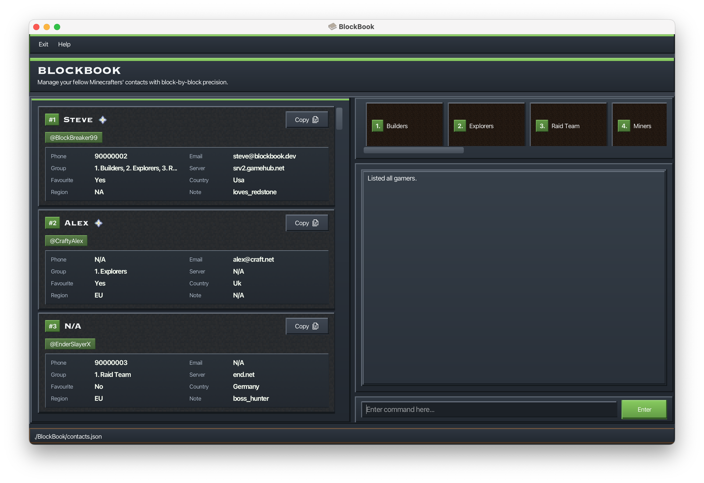

1. Type the command in the command box and press Enter to execute it. e.g. typing **`?`** or **`help`** and pressing Enter will open the built-in help menu, where you can view all the commands available. 
   Some example commands you can try:

    * `list` : Lists all contacts.

    * `add g/JD910 n/John Doe` : Adds a contact named `John Doe` to BlockBook with the gamertag `JD910`.

    * `d 3` : Deletes the 3rd contact shown in the current list. `d` is a shortcut for `delete`.

    * `clear` : Deletes all contacts.

    * `exit` : Exits the app.

1. Refer to the [Features](#features) below for details of each command.

--------------------------------------------------------------------------------------------------------------------

## Features

<box type="info" seamless>

**Notes about the command format:** 

* Words in `UPPER_CASE` are the parameters to be supplied by the user. 
    * e.g. in `add name/NAME`, `NAME` is a parameter which can be used as `add name/John Doe`.

* Characters inside brackets `()` can be typed in place of the full command or full argument prefix. 
    * e.g. `(d)elete` means you can type either `delete` or `d`.
    * e.g. `(g)amertag/` means you can type either `gamertag/` or `g/`.
    * It is okay to mix and match full and short forms of different arguments in the same command.
      e.g. `add g/JD910 name/John Doe` is acceptable.

* Items in square brackets are optional. 
    * e.g `name/NAME [t/TAG]` can be used as `name/John Doe t/friend` or as `name/John Doe`.

* Items with `…` after them can be used multiple times including zero times.
    * e.g. `GAMER_INDEX…` can be used as ` ` (i.e. left blank), `1`, `1 2 3` etc.

* Parameters can be in any order. 
  e.g. if the command specifies `name/NAME gamertag/GAMERTAG`, `gamertag/GAMERTAG name/NAME` is also acceptable.

* Extraneous parameters for commands that do not take in parameters (such as `help`, `list`, `exit` and `clear`) will be ignored. 
  e.g. if the command specifies `help 123`, it will be interpreted as `help`.

* If you are using a PDF version of this document, be careful when copying and pasting commands that span multiple lines as space characters surrounding line-breaks may be omitted when copied over to the application.
</box>

### Viewing help : `help`

Opens this User Guide in a browser window.

Format: `help` or `?`

### Adding a gamer: `add`

Adds a gamer to BlockBook with a required gamertag and optional details such as name, phone number, email address, server, region, country, and notes.

Format: `(a)dd (g)amertag/GAMERTAG [(n)ame/NAME] [(p)hone/PHONE] [(e)mail/EMAIL] [(s)erver/SERVER] [(c)ountry/COUNTRY] [(r)egion/REGION] [note/NOTE]`

Examples:
* `a g/ilovesteve n/Herobrine p/99999 e/brine@gmail.com s/127.0.0.1:8080 c/Singapore r/ASIA note/I hate steve`
* `add gamertag/Notch name/Notch phone/+12345 email/notch@example.com server/mc.example.net:25565 country/Malaysia region/ASIA note/Usually plays survival`

<box type="tip" seamless>

**Tip:** Only `gamertag/` is required. All other fields are optional.
</box>

<box type="info" seamless>

- `gamertag/`: letters, numbers, underscores only, max 50 chars.
- `name/`: letters, spaces, hyphens, apostrophes only, max 50 chars.
- `phone/`: optional leading `+`, digits/spaces/hyphens, at least 3 digits, at most 15 digits.
- `email/`: must be a valid email in the format `local-part@domain`.
- `server/`: letters, numbers, `.`, `-`, `:`, max 50 chars.
- `country/`: letters, spaces, hyphens only, max 50 chars.
- `region/`: accepts `NA`, `SA`, `EU`, `AFRICA`, `ASIA`, `OCEANIA` or `ME`.
- `note/`: letters, numbers, spaces, underscores, hyphens, apostrophes, max 50 chars.
</box>

**Common errors you may encounter:**

- **Duplicate gamertag**  
  You cannot add two gamers with the same gamertag.  
  Gamertags are treated as **case-insensitive**, so `banana`, `Banana`, and `BaNaNa` are all treated as the same gamertag.

- **Missing required gamertag**  
  The `add` command requires a `gamertag/` or `g/` field.  
  Example: `add n/Steve`

- **Repeated prefixes**  
  Each single-value field can only be entered once in the same `add` command.  
  Example: `add g/Steve123 g/Alex456`

- **Invalid gamertag format**  
  Gamertags cannot contain spaces or special characters other than underscores.  
  Example: `g/steve boy`

**Notes:**
- Names and countries are automatically normalized by collapsing repeated spaces and standardizing capitalization.
  For example, `n/jOhN doE` will be stored as `John Doe`.
- Region input is case-insensitive, but will be stored and displayed in uppercase.
  For example, `r/asia` will be stored as `ASIA`.
- Notes are **not** auto-normalized in the same way, so they are stored more closely to how you entered them.
- Newly added gamers are **not favourited** by default.

### Listing all gamers : `list`

Shows a list of all gamers stored in BlockBook.

Format: `(l)ist`

* Clears any active filter (e.g., from `find`) and any active `sort`, restoring original order.

### Editing a gamer : `edit`

Edits an existing gamer stored in BlockBook.
Format: `(e)dit GAMER_INDEX [(g)amertag/GAMERTAG] [(n)ame/NAME] [(p)hone/PHONE] [(e)mail/EMAIL] [(gr)oup/GROUP] [(s)erver/SERVER] [(c)ountry/COUNTRY] [(r)egion/REGION] [note/NOTE]`

* Edits the gamer at the specified `GAMER_INDEX`. The index refers to the index number shown in the displayed gamer list. The index **must be a positive integer** 1, 2, 3, ...
* At least one of the optional fields must be provided.
* Existing values will be updated to the input values.

Examples:
*  `edit 1 p/91234567 email/johndoe@example.com` edits the phone number and email address of the 1st gamer.
*  `e 2 n/Betsy Crower gr/Friends` edits the name and group of the 2nd gamer.

### Editing a gamer’s favourite status : `favourite`, `unfavourite`

Updates a gamer’s favourite status via index

Format: `(fav)ourite GAMER_INDEX` or `(unfav)ourite GAMER_INDEX`

* Updates the favourite status of the gamer at the specified `GAMER_INDEX`. The index refers to the index number shown in the displayed gamer list.

Examples:
*  `fav 1` Updates the favourite status of the first gamer to favourite.
*  `unfavourite 1` Remove the first gamer from favourites.

### Locating gamers: `find`

Finds gamers using either general keyword search or specific attribute prefixes. Has 2 formats.

Format 1: `(f)ind KEYWORD`

* The search is case-insensitive and uses partial (substring) matching.
* If you include spaces in `KEYWORD`, the full phrase is matched as a single substring.

Format 2: `(f)ind [(g)amertag/GAMERTAG] [(n)ame/NAME] [(p)hone/PHONE] [(e)mail/EMAIL] [(gr)oup/GROUP] [(s)erver/SERVER] [(fav)avourite/] [(c)ountry/COUNTRY] [(r)egion/REGION] [note/NOTE]`

* Prefixes can be stacked in one command.
* Prefixes use the same short-form notation, e.g. `(n)ame/` means `name/` or `n/`.

Examples:
* `find steve`
* `f n/steve g/stevemaster`
* `find name/alex region/ASIA` 
  

### Viewing gamers full details: `view`

Shows the full details of a gamer based on the index shown in the current list.

Format: `(v)iew INDEX`

* The `INDEX` refers to the index number shown in the currently displayed list.
* The index must be a positive integer.

Example:
* `view 2` 
  Displays the full details of the 2nd gamer in the current list.

  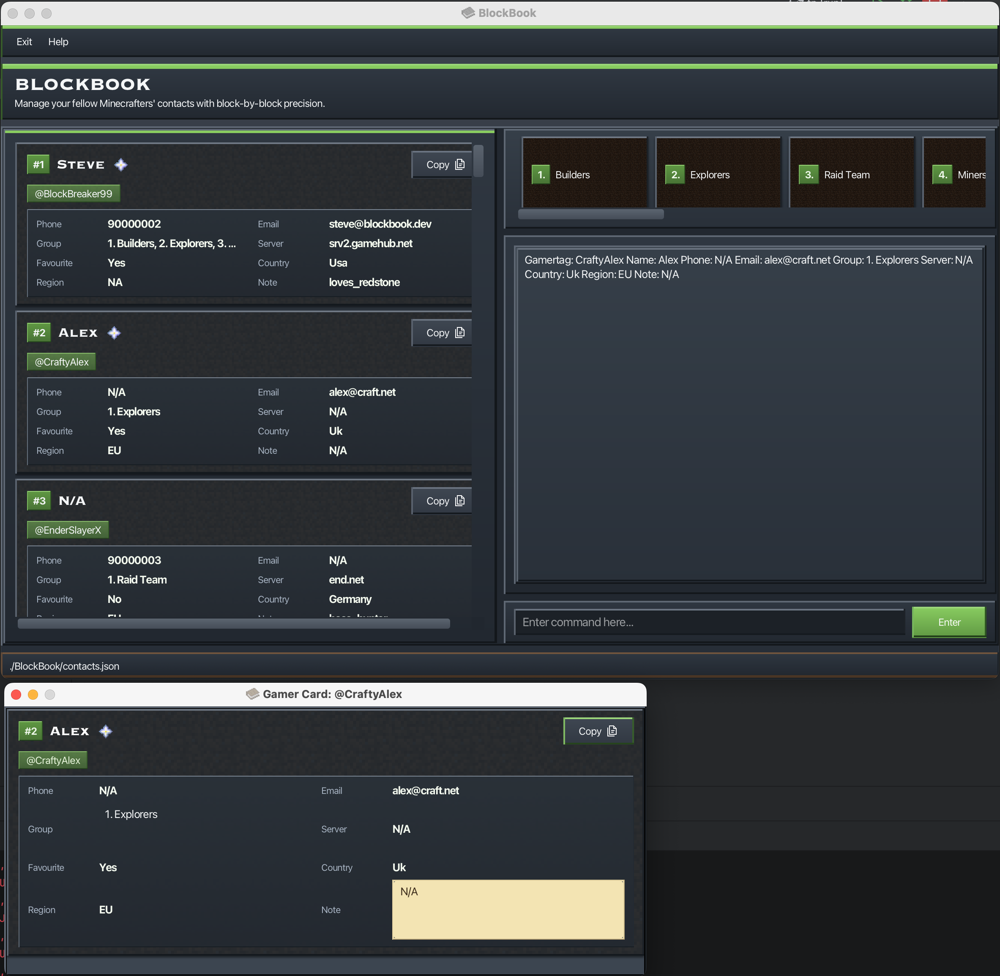

### Sorting gamers : `sort`

Sorts gamers by one or more attributes.

Format: `(s)ort [(g)amertag/] [(n)ame/] [(p)hone/] [(e)mail/] [(gr)oup/] [(s)erver/] [(fav)ourite/] [(c)ountry/] [(r)egion/] [note/]`

* If no attributes are provided, gamers are sorted by **gamertag** by default.
* Attributes are applied in priority order from left to right (first attribute = primary sort key).
* Each attribute can only be specified **once** (e.g., `g/` and `gamertag/` count as the same attribute).
* Attribute tokens are case-sensitive and must be lowercase (e.g., `name/`, not `NAME/`).
* For optional attributes (`name`, `phone`, `email`, `group`, `server`, `country`, `region`, `note`), gamers without that value appear after gamers with a value.
* `favourite/` places favourited gamers before non-favourited gamers.
* `group/` sorts by a gamer's full group set (group names are alphabetically ordered before comparison).
* If a filter is active (e.g., after `find`), the filtered results are shown in the active sort order.
* Sorting is session-based and is not persisted to storage.
* `list` resets sorting and returns to insertion order.

Examples:
* `sort` sorts gamers by gamertag (default).
* `sort name/` sorts gamers by name.
* `s p/ g/` sorts gamers by phone number, then by gamertag.
* `sort favourite/ name/` sorts favourites before non-favourites, then by name within each favourite-status group.

Before running `sort favourite/ name/`:

  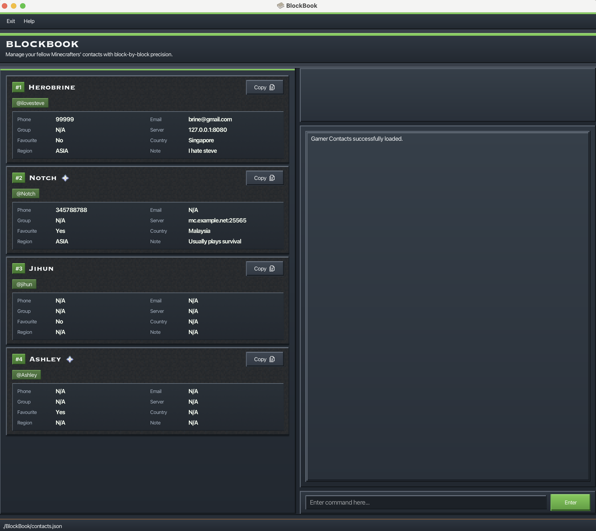

After running `sort favourite/ name/`:

  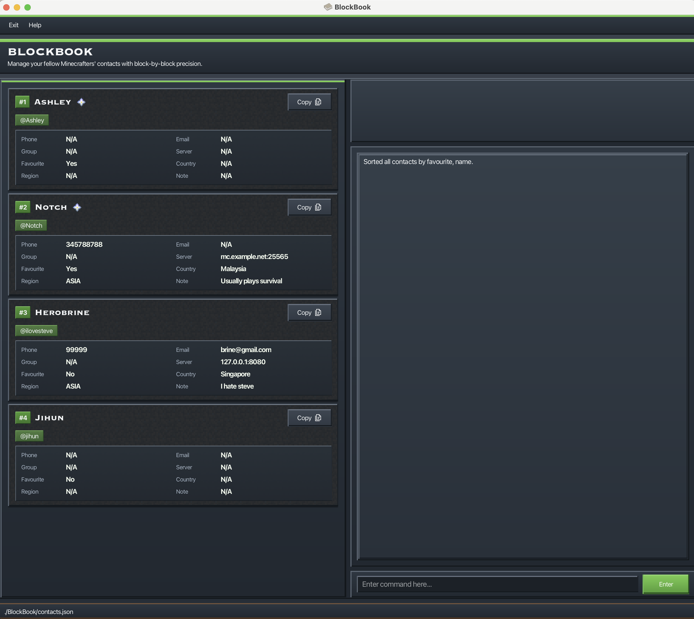

In the `after` screenshot, verify:
* Favourited gamers appear before non-favourited gamers.
* Names are sorted alphabetically (case-insensitive) within the favourited group.
* Names are sorted alphabetically (case-insensitive) within the non-favourited group.

**Common errors you may encounter:**

* **Duplicate attributes**
  Each sort attribute can only be entered once. Short and long forms of the same attribute count as duplicates.
  Example: `sort gamertag/ g/`
  Error shown: `Duplicate attribute detected: gamertag. Each attribute can only be specified once.`
* **Invalid attribute name**
  Unsupported attributes are rejected.
  Example: `sort rank/`
  Error shown: `Invalid attribute detected: rank. Please provide a valid sort attribute.`
* **Multiple invalid attributes**
  If more than one invalid attribute is provided, all invalid attributes are reported together.
  Example: `sort rank/ level/`
  Error shown: `Invalid attributes detected: rank, level. Please provide only valid sort attributes.`
* **Invalid format**
  Every attribute token must end with `/`.
  Example: `sort name`
  Error shown: `Invalid command format!` followed by the sort usage format.
* **No gamers to sort**
  `sort` cannot run when the gamer list is empty.
  Error shown: `There are no contacts to sort!`

**Notes:**

* You can mix long and short forms in one command. Example: `sort name/ p/`.
* `note/` has no short alias.
* For whole-list sorting after `find`, run `list`, then run `sort` again.

### Deleting a Gamer : `delete`

Deletes the specified gamers from BlockBook.

Format: `(d)elete GAMER_INDEX [GAMER_INDEX]...`

* Deletes the gamers at each specified `GAMER_INDEX`.
* Trying to delete the same index multiple times will only cause that index to be deleted once.
* The indexes refer to the index numbers shown in the displayed gamer list.
* The indexes do not have to be in any particular order. e.g. `delete 2 1` is acceptable.
* Each index **must be a positive integer** 1, 2, 3, ...

Examples:
* `list` followed by `delete 2` deletes the 2nd gamer shown in the list.
* `find Betsy` followed by `delete 1 2` deletes the 1st and 2nd gamer in the results of the `find` command.
* `d 2 1` deletes the 1st and 2nd gamer shown in the list.
* `delete 1 2 2` deletes only the 1st and 2nd gamers shown in the list. The 2nd gamer is only deleted once.

### Clearing all entries : `clear [CONFIRMATION_CODE]`

Clears all entries from BlockBook.

Format: `clear [CONFIRMATION_CODE]`

* Running `clear` without a confirmation code will display a warning and a confirmation code.
* To confirm, re-enter the command using the code shown (e.g., `clear abc123`).
* If you enter the wrong code, BlockBook will show a new confirmation code.

Examples:
* `clear` shows a warning and a confirmation code (e.g., `clear abc123`).
* `clear abc123` clears all entries.

### Creating a group : `groupcreate`

Creates a new group in BlockBook.

Format: `groupcreate GROUP` or `gc GROUP`

* Group names are **case-insensitive** and must be unique.
* Group names can contain only letters, spaces, hyphens, and apostrophes, and must be at most 50 characters.

Examples:
* `groupcreate Raid Team`
* `gc Arena Team`

* 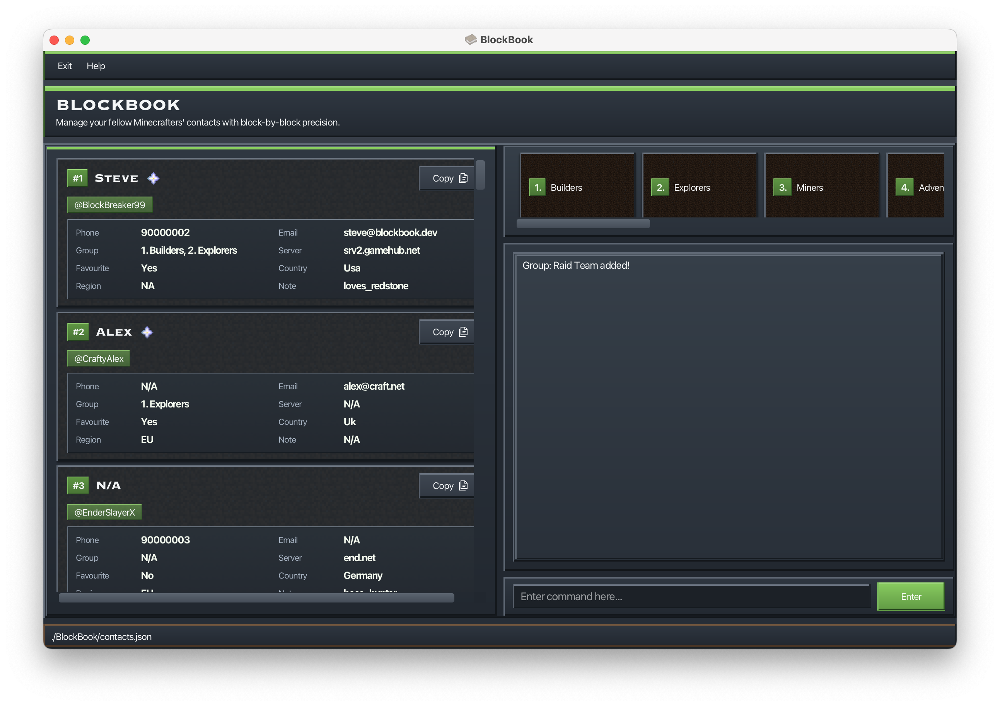

### Editing a group's name : `groupedit`

Renames an existing group by its index in the group list.

Format: `groupedit BLOCKBOOK_GROUP_INDEX NEW_GROUP_NAME` or `ge BLOCKBOOK_GROUP_INDEX NEW_GROUP_NAME`

* The `BLOCKBOOK_GROUP_INDEX` refers to the index shown in the group list.
* The new group name follows the same constraints as group creation.
* Renaming is case-insensitive for uniqueness (e.g., renaming `Raid Team` to `raid team` is allowed).

Examples:
* `groupedit 1 iloveAlex`
* `ge 2 Arena Team`

* 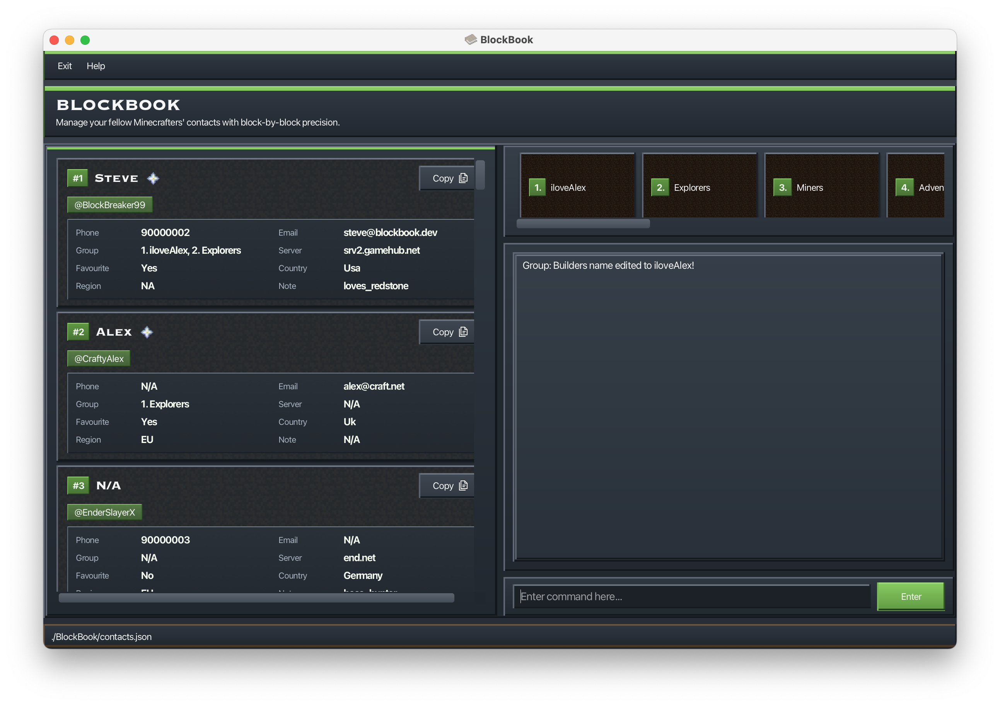

### Deleting a group : `groupnuke BLOCKBOOK_GROUP_INDEX [CONFIRMATION_CODE]`

Deletes a group from BlockBook and removes that group from all gamers associated to it.

Format: `groupnuke BLOCKBOOK_GROUP_INDEX [CONFIRMATION_CODE]` or `gn BLOCKBOOK_GROUP_INDEX [CONFIRMATION_CODE]`

* This is a **destructive** command and requires confirmation.
* BB will show a warning message with a confirmation code and the affected gamertags.
* Re-run the command with the confirmation code appended to proceed.
* If you enter the wrong code, BB will show a new confirmation code.

Example:
* `groupnuke 1`  
  BB will prompt you with a confirmation code.

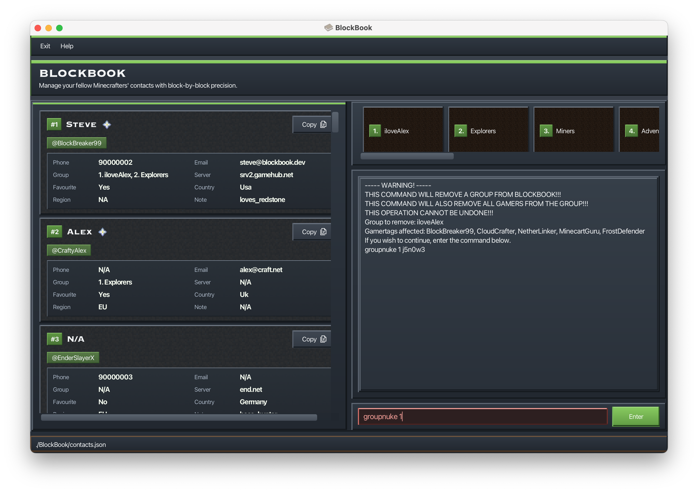
* `groupnuke 1 j5n0w3`  
  Deletes the group and removes it from all gamers.

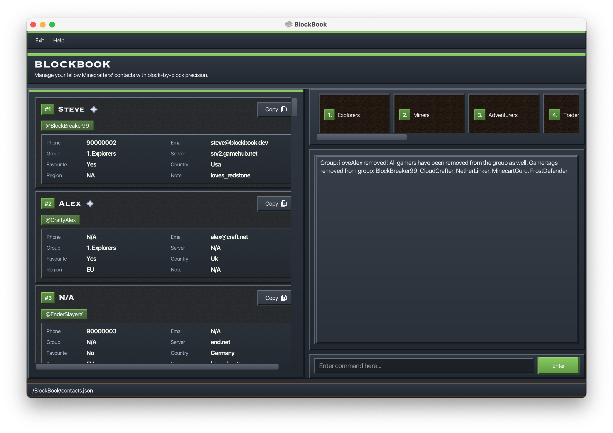

### Adding a gamer to a group : `groupadd`

Adds a specific gamer to a specific group in a single command, by providing the gamer’s index in the current list and the group’s index in the group list.

Format: `groupadd GAMER_INDEX BLOCKBOOK_GROUP_INDEX` or `ga GAMER_INDEX BLOCKBOOK_GROUP_INDEX`

* `GAMER_INDEX` refers to the index shown in the current gamer list.
* `BLOCKBOOK_GROUP_INDEX` refers to the index shown in the group list.

Example:
* `groupadd 2 1` adds the 2nd gamer in the current list to the 1st group in the group list.

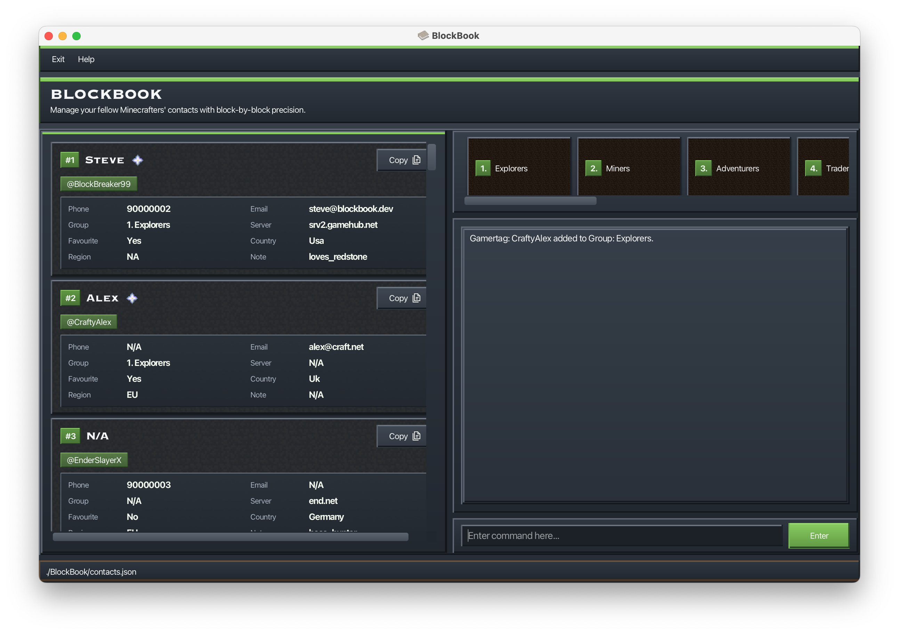

### Removing a gamer from a group : `groupremove`

Removes a specific group from a specific gamer in a single command, by providing the gamer’s index in the current list and the group’s index in that gamer’s group list.

Format: `groupremove GAMER_INDEX GAMER_GROUP_INDEX` or `gr GAMER_INDEX GAMER_GROUP_INDEX`

* `GAMER_INDEX` refers to the index shown in the current gamer list.
* `GAMER_GROUP_INDEX` refers to the index shown in that gamer’s group list (not the global group list).

Example:
* `groupremove 2 1` removes the 1st group from the 2nd gamer in the current list.

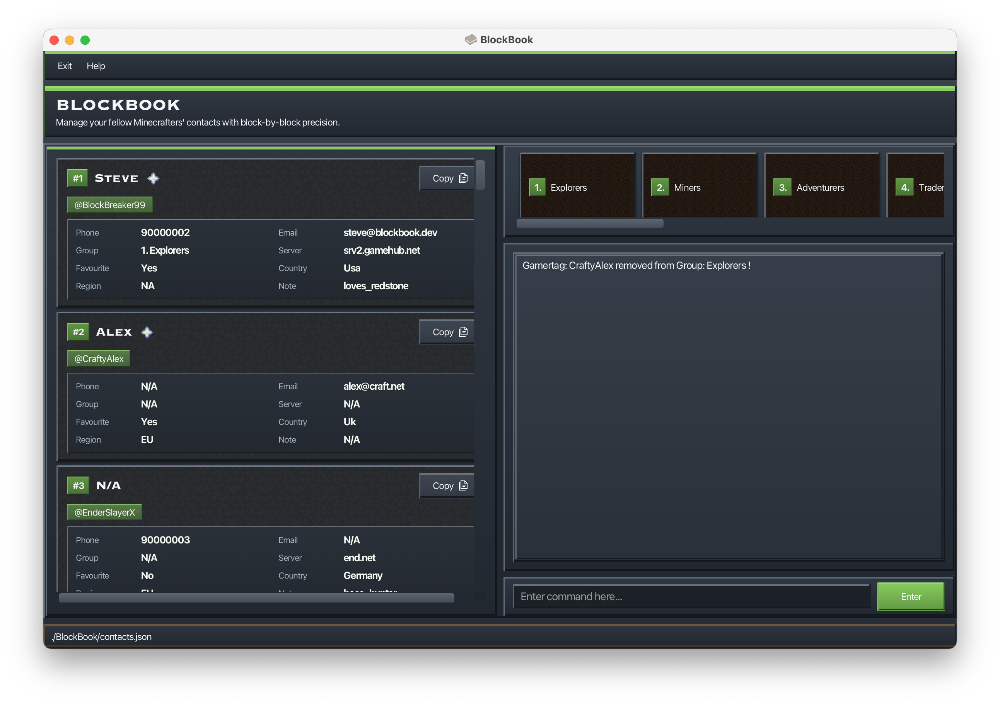

### Listing all groups : `grouplist`

Lists all groups stored in BlockBook.

Format: `grouplist` or `gl`

* If there are no groups, BB will indicate that no groups were found.

Example:
* `grouplist`

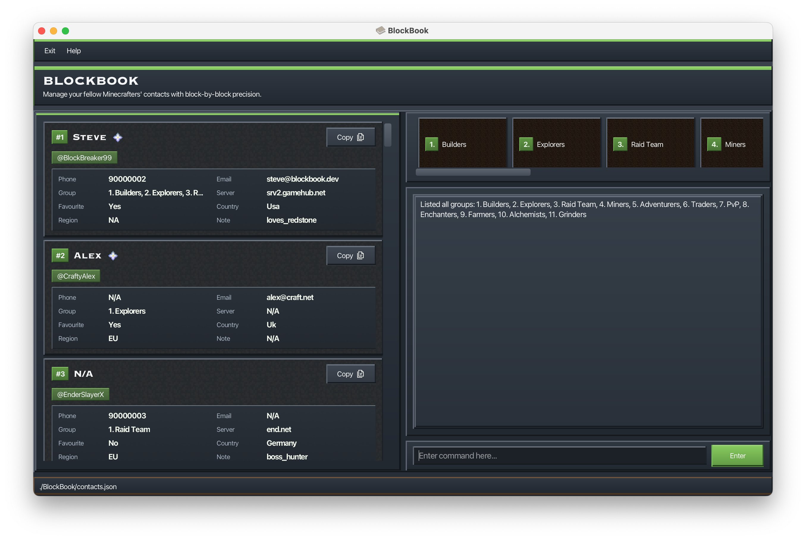

### Viewing a group : `groupview`

Shows all gamers that belong to a specific group, and filters the list to those gamers.

Format: `groupview BLOCKBOOK_GROUP_INDEX` or `gv BLOCKBOOK_GROUP_INDEX`

* `BLOCKBOOK_GROUP_INDEX` refers to the index shown in the group list.
* The displayed gamer list is filtered to show only members of the selected group.
* If no gamers belong to the group, BB will show a message and keep the current list unchanged.

Example:
* `groupview 1` shows all gamers in the 1st group.

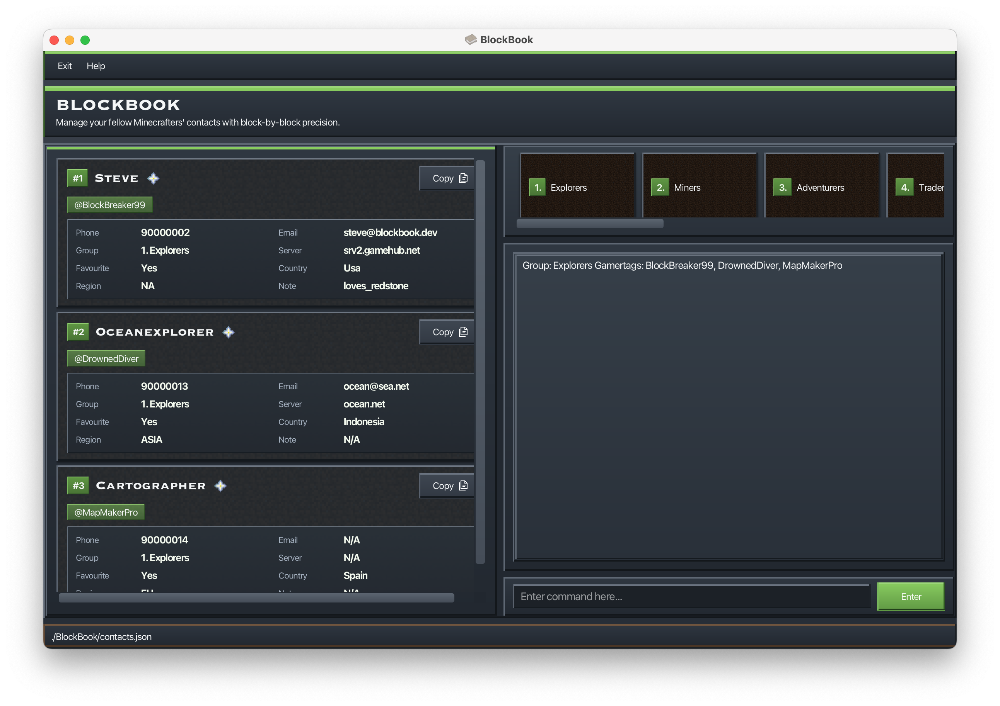

### Exiting the program : `exit`

Exits the program.

Format: `exit`

### Saving the data

BlockBook data is saved to primary storage automatically after any command that changes the data. There is no need to save manually.

### Editing the data file

BlockBook data is saved automatically as a JSON file `[JAR file location]/data/contacts.json`. Advanced users are welcome to update data directly by editing that data file.

<box type="warning" seamless>

**Caution:**
If your changes to the data file makes its format invalid, BlockBook will discard all data and start with an empty data file at the next run.  Hence, it is recommended to take a backup of the file before editing it. 
Furthermore, certain edits can cause BlockBook to behave in unexpected ways (e.g., if a value entered is outside the acceptable range). Therefore, edit the data file only if you are confident that you can update it correctly.

</box>

### Archiving data files `[coming in v2.0]`

_Details coming soon ..._

--------------------------------------------------------------------------------------------------------------------

## FAQ

**Q**: How do I transfer my data to another Computer? 
**A**: Install the app in the other computer and overwrite the empty data file it creates with the file that contains the data of your previous BlockBook home folder.

--------------------------------------------------------------------------------------------------------------------

## Known issues

1. **When using multiple screens**, if you move the application to a secondary screen, and later switch to using only the primary screen, the GUI will open off-screen. The remedy is to delete the `preferences.json` file created by the application before running the application again.

--------------------------------------------------------------------------------------------------------------------

## Command summary

| Action     | Format, Examples                                                                                                           |
|------------|----------------------------------------------------------------------------------------------------------------------------|
| **Add**    | `(a)dd (g)amertag/GAMERTAG [(n)ame/NAME]...`   e.g., `add g/JamieH n/James Ho`                                          |
| **Clear**  | `clear [CONFIRMATION_CODE]`                                                                                                |
| **Delete** | `(d)elete GAMER_INDEX [GAMER_INDEX]...`  e.g., `delete 3`, `delete 2 5`                                                 |
| **Edit**   | `(e)dit GAMER_INDEX [(g)amertag/GAMERTAG] [(n)ame/NAME]...`  e.g., `edit 2 n/James Lee`                                 |
| **Find**   | `(f)ind KEYWORD`  e.g., `find James`  `find [(n)ame/NAME] [(g)amertag/GAMERTAG]...`  e.g., `find n/Steve g/Block` |
| **View**   | `(v)iew GAMER_INDEX`   e.g., `view 2`                                                                                   |
| **List**   | `(l)ist`                                                                                                                   |
| **Sort**   | `(s)ort [(g)amertag/] [(n)ame/]...`  e.g., `sort`, `sort n/`, `sort p/ g/`                                              |
| **Help**   | `help`, `?`                                                                                                                |
| **Group Create** | `groupcreate GROUP`, `gc GROUP`  e.g., `gc Raid Team`                                                                   |
| **Group Edit**   | `groupedit BLOCKBOOK_GROUP_INDEX NEW_GROUP_NAME`, `ge ...`  e.g., `ge 1 Arena Team`                                     |
| **Group Delete** | `groupnuke BLOCKBOOK_GROUP_INDEX [CONFIRMATION_CODE]`, `gn ...`  e.g., `gn 1 abc123`                                    |
| **Group Add**    | `groupadd GAMER_INDEX BLOCKBOOK_GROUP_INDEX`, `ga ...`  e.g., `ga 2 1`                                                  |
| **Group Remove** | `groupremove GAMER_INDEX GAMER_GROUP_INDEX`, `gr ...`  e.g., `gr 2 1`                                                   |
| **Group List**   | `grouplist`, `gl`                                                                                                          |
| **Group View**   | `groupview BLOCKBOOK_GROUP_INDEX`, `gv ...`  e.g., `gv 1`                                                               |
